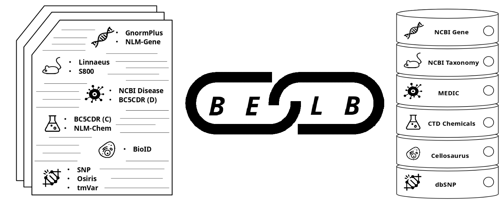

# BELB: Biomedical Entity Linking Benchmark<a name="belb-biomedical-entity-linking-benchmark"></a>

<p align="center">

</p>

the **B**iomedical **E**ntity **L**inking **B**enchmark (**BELB**) is a collection of datasets and knowledge bases
to train and evaluate biomedical entity linking models.

<!-- mdformat-toc start --slug=github --maxlevel=6 --minlevel=2 -->

- [Citing](#citing)
- [Data](#data)
  - [Knowledge Bases](#knowledge-bases)
  - [Corpora](#corpora)
- [Setup](#setup)
  - [PubTator database](#pubtator-database)
  - [Knowledge Bases](#knowledge-bases-1)
    - [dbSNP](#dbsnp)
    - [UMLS](#umls)
  - [Corpora](#corpora-1)
- [API](#api)
- [Roadmap](#roadmap)
  - [Datasets:](#datasets)
  - [Knowledge Bases:](#knowledge-bases)
  - [Snapshot](#snapshot)

<!-- mdformat-toc end -->

## Citing<a name="citing"></a>

If you use BELB in your work, please cite:

```
@article{10.1093/bioinformatics/btad698,
    author = {Garda, Samuele and Weber-Genzel, Leon and Martin, Robert and Leser, Ulf},
    title = {{BELB}: a {B}iomedical {E}ntity {L}inking {B}enchmark},
    journal = {Bioinformatics},
    pages = {btad698},
    year = {2023},
    month = {11},
    issn = {1367-4811},
    doi = {10.1093/bioinformatics/btad698},
    url = {https://doi.org/10.1093/bioinformatics/btad698},
    eprint = {https://academic.oup.com/bioinformatics/advance-article-pdf/doi/10.1093/bioinformatics/btad698/53483107/btad698.pdf},
}
```

## Data<a name="data"></a>

### Knowledge Bases<a name="knowledge-bases"></a>

| Corpus               | Entity    | Public | Versioned | Website                                                      | Download                                                                                                                     |
| -------------------- | --------- | ------ | --------- | ------------------------------------------------------------ | ---------------------------------------------------------------------------------------------------------------------------- |
| NCBI Gene            | Gene      | ✅     | ❌        | [homepage](https://www.ncbi.nlm.nih.gov/gene)                | [kb](https://ftp.ncbi.nih.gov/gene/DATA/gene_info.gz), [history](https://ftp.ncbi.nih.gov/gene/DATA/gene_history.gz)         |
| NCBI Taxonomy        | Species   | ✅     | ❌        | [homepage](https://www.ncbi.nlm.nih.gov/taxonomy)            | [kb, history](https://ftp.ncbi.nih.gov/pub/taxonomy/)                                                                        |
| CTD Diseases (MEDIC) | Disease   | ✅     | ❌        | [homepage](https://ctdbase.org/)                             | [kb](http://ctdbase.org/downloads/#alldiseases)                                                                              |
| CTD Chemicals        | Chemical  | ✅     | ❌        | [homepage](https://ctdbase.org/)                             | [kb](http://ctdbase.org/downloads/#allchems)                                                                                 |
| dbSNP                | Variant   | ✅     | ✅        | [homepage](https://www.ncbi.nlm.nih.gov/snp/)                | [kb,history](ftp://ftp.ncbi.nlm.nih.gov/snp/redesign/latest_release/JSON)                                                    |
| Cellosaurus          | Cell line | ✅     | ❌        | [homepage](https://www.cellosaurus.org/)                     | [kb](https://ftp.expasy.org/databases/cellosaurus/cellosaurus.txt), [history](https://ftp.expasy.org/databases/cellosaurus/) |
| UMLS                 | General   | ❌     | ✅        | [homepage](https://www.nlm.nih.gov/research/umls/index.html) | -                                                                                                                            |

### Corpora<a name="corpora"></a>

| Corpus                   | Entity                 | Public | Website                                                                                                                                            | Download                                                                                                             |
| ------------------------ | ---------------------- | ------ | -------------------------------------------------------------------------------------------------------------------------------------------------- | -------------------------------------------------------------------------------------------------------------------- |
| GNormPLus (improved BC2) | Gene                   | ✅     | [homepage](https://www.ncbi.nlm.nih.gov/research/bionlp/Tools/gnormplus/)                                                                          | [link](https://www.ncbi.nlm.nih.gov/CBBresearch/Lu/Demo/tmTools/download/GNormPlus/GNormPlusCorpus.zip)              |
| NLM-Gene                 | Gene                   | ✅     | [homepage](https://pubmed.ncbi.nlm.nih.gov/33839304/)                                                                                              | [link](ftp://ftp.ncbi.nlm.nih.gov/pub/lu/NLMGene)                                                                    |
| NCBI-Disease             | Disease                | ✅     | [homepage](https://www.ncbi.nlm.nih.gov/CBBresearch/Dogan/DISEASE/)                                                                                | [link](https://www.ncbi.nlm.nih.gov/CBBresearch/Dogan/DISEASE/NCBI_corpus.zip)                                       |
| BC5CDR                   | Disease, Chemical      | ✅     | [homepage](https://biocreative.bioinformatics.udel.edu/tasks/biocreative-v/track-3-cdr/)                                                           | [link](https://biocreative.bioinformatics.udel.edu/media/store/files/2016/CDR_Data.zip)                              |
| NLM-Chem                 | Chemical               | ✅     | [homepage](https://pubmed.ncbi.nlm.nih.gov/33767203/)                                                                                              | [link](https://ftp.ncbi.nlm.nih.gov/pub/lu/BC7-NLM-Chem-track/BC7T2-NLMChem-corpus_v2.BioC.xml.gz)                   |
| Linnaeus                 | Species                | ✅     | [homepage](https://linnaeus.sourceforge.net/)                                                                                                      | [link](https://sourceforge.net/projects/linnaeus/files/Corpora/manual-corpus-species-1.0.tar.gz/download)            |
| S800                     | Species                | ✅     | [homepage](https://species.jensenlab.org/)                                                                                                         | [link](https://species.jensenlab.org/files/S800-1.0.tar.gz)                                                          |
| BioID                    | Cell, Species, Gene    | ✅     | [homepage](https://biocreative.bioinformatics.udel.edu/tasks/biocreative-vi/track-1/)                                                              | [link](https://biocreative.bioinformatics.udel.edu/media/store/files/2017/BioIDtraining_2.tar.gz)                    |
| Osiris                   | Gene, Variant          | ✅     | [homepage](https://sites.google.com/site/laurafurlongweb/databases-and-tools/corpora/)                                                             | [link](https://raw.githubusercontent.com/rockt/SETH/master/resources/OSIRIS/corpus.xml)                              |
| Thomas2011               | Variant                | ✅     | [homepage](https://www.scai.fraunhofer.de/en/business-research-areas/bioinformatics/downloads/corpus-for-normalization-of-variation-mentions.html) | [link](https://www.scai.fraunhofer.de/content/dam/scai/de/downloads/bioinformatik/normalization-variation-corpus.gz) |
| tmVar (v3)               | Gene, Species, Variant | ✅     | [homepage](https://www.ncbi.nlm.nih.gov/research/bionlp/Tools/tmvar/)                                                                              | [link](https://ftp.ncbi.nlm.nih.gov/pub/lu/tmVar3/tmVar3Corpus.txt)                                                  |
| MedMentions              | UMLS                   | ✅     | [homepage](https://github.com/chanzuckerberg/MedMentions)                                                                                          | [link](https://github.com/chanzuckerberg/MedMentions)                                                                |

## Setup<a name="setup"></a>

We assume that all data will be stored in a single directory.

This reduces flexibility, but due to the inter-connection of all data (corpora and KB)
this is a trade-off to ease accessibility.

### PubTator database<a name="pubtator-database"></a>

Download PubTator raw data (compressed:~19GB) and `PMCID->PMID` mapping (compressed: ~155MB).
This is needed to add annotations to certain corpora and add the text to those which provide only annotations.

```bash
mkdir -p <PUBTATOR>
cd <PUBTATOR>
wget https://ftp.ncbi.nlm.nih.gov/pub/lu/PubTatorCentral/bioconcepts2pubtatorcentral.offset.gz 
wget https://ftp.ncbi.nlm.nih.gov/pub/pmc/PMC-ids.csv.gz
```

```bash
python -m scripts.build_pubtator 
       --pubtator <PUBTATOR>/bioconcepts2pubtatorcentral.offset.gz 
       --pmicid_pmid <PUBTATOR>/PMC-ids.csv.gz
       --output pubtator.db 
       --overwrite
```

### Knowledge Bases<a name="knowledge-bases-1"></a>

All knowledge bases will be automatically downloaded for you, with two exceptions: dbSNP and UMLS.

#### dbSNP<a name="dbsnp"></a>

As dbSNP is a large resource (>100GB) it is best to launch a separate process to fetch it.

Essentially it boils down to:

```bash
mkdir -p <DBSNP> 
cd <DBSNP>

echo "Fetch dbSNP latest release..."
wget --continue "ftp://ftp.ncbi.nlm.nih.gov/snp/redesign/latest_release/JSON/refsnp-chr*.bz2"
wget --continue "ftp://ftp.ncbi.nlm.nih.gov/snp/redesign/latest_release/JSON/refsnp-unsupported.json.bz2"
wget --continue "ftp://ftp.ncbi.nlm.nih.gov/snp/redesign/latest_release/JSON/refsnp-withdrawn.json.bz2"

echo "Identify corrupted files: please delete and re-initiate download for all corrupted files..."
find . -name *.bz2 -exec bunzip2 --test {} \;
```

See [here](http://rockt.github.io/SETH/) for more details.

#### UMLS<a name="umls"></a>

See [here](https://www.nlm.nih.gov/research/umls/index.html) for more details on how to request a license.

You need to download the `2017AA full version` as this is the one used by the corpus [MedMentions](https://github.com/chanzuckerberg/MedMentions).

In principle the parser should work with later versions too,
it expects as input a folder (usually cold `META`)
where containing the files `MRCONSO.RFF` and `MRCUI.RFF`.

The `2017AA` is the last one that does not provide direct access to the UMLS raw data ("Metathesaurus Files").
To access the data w/o setting up a mysql database you can to the following:

```bash
unzip umls-2017AA-full.zip
cd 2017AA-full
# poorly disguised zip files...
unzip 2017aa-1-meta.nlm 2017aa-2-meta.nlm
cd 2017AA/META
gunzip MRCONSO.RRF.aa.gz MRCONSO.RRF.ab.gz MRCUI.RRF.gz
cat MRCONSO.RRF.aa MRCONSO.RRF.ab > MRCONSO.RFF
```

Once you have downloaded these two resources you can launch the script:

```python
python -m belb.scripts.build_kbs --dir <BELB> --cores 20 --umls <path/to/umls/META> --dbsnp <path/to/dbsnp>
```

This will fetch all the other kbs data and convert them to a unified schema and store them as TSV files.

Each kb can be processed individually with its corresponding module, e.g.:

```bash
python -m belb.kbs.umls
       --dir  /belb/directory
       --data_dir /path/to/umls/data
       --db ./db.yaml
```

By default all kbs are stored as sqlite databases.
The `db.yaml` can be edited to your liking if you wish to store the data into a database.
This feature is only paritally tested and it supports only postgres.

### Corpora<a name="corpora-1"></a>

Once all kbs are ready you can create all benchmark corpora via:

```bash
python -m belb.scripts.build_corpora --dir <BELB> --pubtator <BELB>/pubtator/pubtator.db 
```

Similarly to kbs, you can also create a single corpus:

```bash
python -m belb.corpora.ncbi_disease --dir  /belb/directory --sentences
```

This will fetch the ncbi disease corpus, preprocess it, split text into sentences (`--sentences`)
and store it into the belb directory.

## API<a name="api"></a>

Every resource (corpus, kb) is represented by a module which acts as a standalone script as well.
This means you can programmatically access a resource:

```python
from belb.kbs.kb import BelbKb
from belb.kbs.ncbi_gene import NcbiGeneKbConfig
from belb.corpora.nlm_gene import NlmGeneCorpusParser
```

For ease of access we provide a two classes to instantiate corpora and kbs respectively
simply by providing an identifying name
(a poor reproduction of what you see in the `Auto*` classes in the [transformers](https://github.com/huggingface/transformers#quick-tour) library).

```python
from belb import AutoBelbCorpus, AutoBelbKb
from belb.resources import Corpora, Kbs

corpus = AutoBelbCorpus.from_name(directory="path_to_belb", name=Corpora.NCBI_DISEASE.name)
kb = AutoBelbKb.from_name(directory="path_to_belb", name=Kbs.CTD_DISEASES.name)
```

## Roadmap<a name="roadmap"></a>

### Datasets:<a name="datasets"></a>

- [BioRED](https://academic.oup.com/bib/article/23/5/bbac282/6645993) - [data](https://ftp.ncbi.nlm.nih.gov/pub/lu/BioRED/)
- [CRAFT (v4.0)](https://github.com/UCDenver-ccp/CRAFT)
- [BC5-CHEMDNER-patents-GPRO](https://biocreative.bioinformatics.udel.edu/tasks/biocreative-v/track-2-chemdner/)
- [AskAPatient](https://aclanthology.org/P16-1096.pdf) - [data](https://zenodo.org/record/55013#.YrwPb_exVqg)
- [TwADR-L](https://aclanthology.org/P16-1096.pdf) - [data](https://zenodo.org/record/55013#.YrwPb_exVqg)
- [COMETA](https://aclanthology.org/2020.emnlp-main.253.pdf) - data: "COMETA is available by contacting the last author via e-mail or following the instructions on https://www.siphs.org/."
- [ShARe](https://aclanthology.org/S14-2007.pdf)
- [2019 n2c2/UMass Lowell shared task](https://academic.oup.com/jamia/article/27/10/1529/5910736)
- [TAC2017ADR](https://tac.nist.gov/publications/2017/additional.papers/TAC2017.ADR_overview.proceedings.pdf) - [data](https://bionlp.nlm.nih.gov/tac2017adversereactions/)

### Knowledge Bases:<a name="knowledge-bases"></a>

- [UBERON](http://obophenotype.github.io/uberon/)
- [Cell Ontology](https://cell-ontology.github.io/)
- [ChEBI](https://obofoundry.org/ontology/chebi.html)
- [PubChem](https://pubchem.ncbi.nlm.nih.gov/)
- [UniProt](https://www.uniprot.org/)

### Snapshot<a name="snapshot"></a>

Create snapshot regularly for ease of reproducibility.
This would require contacting resources providers and verify that it is doable,
i.e. redistribution issues may arise.
