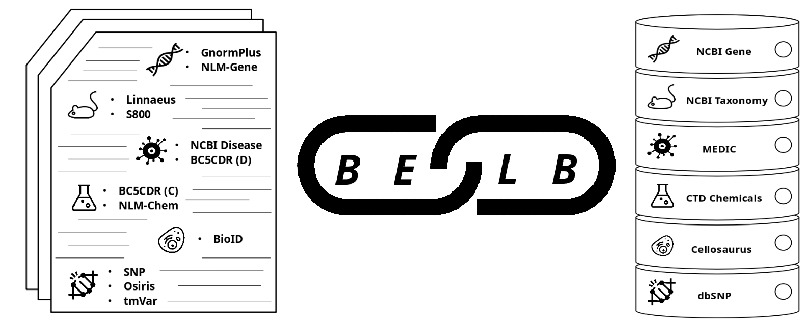

# BELB: a Biomedical Entity Linking Benchmark

<p align="center">

</p>

the **B**iomedical **E**nity **L**inking **B**enchmark (**BELB**) is a collection of corpora (datasets) and knowledge
bases (a.k.a. ontologies or vocabularies) to train and evaluate entity linking models for the biomedical literature.

> [!NOTE] This is a complete rewrite. Original version is in branch `v1`.

<!-- mdformat-toc start --slug=github --maxlevel=6 --minlevel=2 -->

- [Quick Start](#quick-start)
  - [Installation](#installation)
  - [Example](#example)
- [Configuration](#configuration)
  - [Pairs](#pairs)
  - [Corpora](#corpora)
  - [KBs](#kbs)
  - [Task](#task)
- [Corpora](#corpora-1)
  - [QAQC](#qaqc)
    - [Offsets](#offsets)
    - [Identifiers](#identifiers)
- [Knowledge Bases](#knowledge-bases)
  - [Names](#names)
  - [History](#history)
  - [Local only](#local-only)
    - [UMLS](#umls)
    - [dbSNP](#dbsnp)
- [Citing](#citing)

<!-- mdformat-toc end -->

## Quick Start<a name="quick-start"></a>

### Installation<a name="installation"></a>

```bash
pip install pip@https://github.com/sg-wbi/belb
```

### Example<a name="example"></a>

```python
from belb import load_config, load_pair

config = load_config()
pair = load_pair(name='bc5cdr-chemical.mesh', config=config)

print(pair.corpus)
# DatasetDict({
#     train: Dataset({
#         features: ['id', 'text', 'annotations', 'metadata'],
#         num_rows: 500
#     })
#     validation: Dataset({
#         features: ['id', 'text', 'annotations', 'metadata'],
#         num_rows: 500
#     })
#     test: Dataset({
#         features: ['id', 'text', 'annotations', 'metadata'],
#         num_rows: 500
#     })
# })

print(pair.kb)
# DatasetDict({
#     entities: Dataset({
#         features: ['id', 'label', 'aliases', 'description', 'mapped_to_ids', 'tree_numbers', 'qualifiers', 'pharmacological_actions', 'idx'],
#         num_rows: 256871
#     })
# })
```

That's it! You now have access to a standardized corpus and KB for you experiments.

## Configuration<a name="configuration"></a>

The default configuration is a folder (default packaged in `src/assets/config/`), which consists of the following YAML
files:

- `pairs.yaml`
- `corpora.yaml`
- `kbs.yaml`
- `task.yaml`

Each entry in each file can be overridden by passing your own `config_dir`:

```python
from belb import load_config, load_pair

config = load_config(config_dir='./data/configs/local', default=True)
```

If you want to load only your own configuration pass `default=False` to `load_config`.

### Pairs<a name="pairs"></a>

Each entry in `pairs.yaml` defines a specific test case: which dataset to use, which KB to link to, and any filtering or
alignment parameters required to ensure consistency.

```yaml
- name: bc5cdr-chemical.mesh
  corpus: bc5cdr
  corpus_args:
    entity_types:
      - chemical
    id_mapping: mesh[D]
  kb: mesh
  kb_args:
    branches:
      - D
```

The fields:

- **`name`**: Arbitrary unique identifier for this corpus-KB pair. Used when calling `load_pair`.
- **`corpus`**: Key for the corpus (dataset) to use. Must correspond to an entry in `corpora.yaml`.
- **`corpus_args`** (optional): Dictionary of corpus-specific options (defined by corpus load
    `src/corpus/<corpus-name>.py`). For example:
    - Filtering annotations to entities of a particular type (`entity_types`) if the corpus supports multiple
    - A mapping to align corpus and KB identifiers (`id_mapping`; see [Corpora](#corpora) for details).
- **`kb`**: Key of the KB to use for this scenario. Must correspond to an entry in `kbs.yaml`.
- **`kb_args`** (optional): Dictionary of kb-specific options (defined by corpus load `src/kb/<kb-name>.py`). For
    example, used to load a subset of the KB.

### Corpora<a name="corpora"></a>

The `corpora.yaml` file lists supported corpora (datasets). Due to licensing restrictions, precomputed corpora cannot be
distributed on the HuggingFace Hub, so dataset entries provide only download links to the original sources.

You can use the `scripts/push_to_hub.py` script to upload your own data to a **private** HuggingFace repository and
specify its `hf_repo_id` in your custom configuration.

```yaml
bc5cdr:
  hf_repo_id: 'my-private-repo/bc5cdr'
  data_files:
    - name: 'train'
      uri: 'https://ftp.ncbi.nlm.nih.gov/pub/lu/BC5CDR/CDR_TrainingSet.PubTator.txt'
    - name: 'validation'
      uri: 'https://ftp.ncbi.nlm.nih.gov/pub/lu/BC5CDR/CDR_DevelopmentSet.PubTator.txt'
    - name: 'test'
      uri: 'https://ftp.ncbi.nlm.nih.gov/pub/lu/BC5CDR/CDR_TestSet.PubTator.txt'
  # data_dir: '/your/local/bc5cdr/files'
  # data_files:
  #   - name: 'train'
  #     uri: 'CDR_TrainingSet.PubTator.txt'
```

### KBs<a name="kbs"></a>

The `kbs.yaml` file lists supported KBs. For most KBs, we provide precomputed data on the HuggingFace Hub via
`hf_repo_id`. If redistribution isn't possible, direct download links (`uri`) are given in `data_files`.

You can override or update entries (e.g., to replace a broken link) by providing your own `kbs.yaml` with the
`config_dir` argument to `load_config()`.

**To use local files**, add `data_dir` pointing to your directory, and set each `uri` in `data_files` to the local
filename as shown in the example:

```yaml
mesh:
  hf_repo_id: 'bel-bench/mesh'
  data_files:
    - name: 'desc_file'
      uri: 'https://nlmpubs.nlm.nih.gov/projects/mesh/2021/xmlmesh/desc2021.xml'
    - name: 'supp_file'
      uri: 'https://nlmpubs.nlm.nih.gov/projects/mesh/2021/xmlmesh/supp2021.xml'
  # data_dir: '/your/local/mesh/files'
  # data_files:
  #   - name: 'desc_file'
  #     uri: 'desc2021.xml'
  #   - name: 'supp_file'
  #     uri: 'supp2021.xml'
```

If `hf_repo_id` is provided this takes precedence, while local files (`data_dir` is not `null`) are preferred over
links.

### Task<a name="task"></a>

The `task.yaml` file controls how BELB processes and filters benchmark data.

```yaml
inkb: true     
endtoend: false
composite_mentions: false
```

- **`inkb`**: Determines whether annotations that cannot be linked to the KB (`NIL`) are kept (`false`) or removed
    (`true`). Set this to `false` if you experiment with `NIL`-linking.
- **`endtoend`**: Determines whether documents with no annotations are kept (`true`) or removed (`false`). Set this to
    `true` if you experiment with joint entity recognition and linking.
- **`composite_mentions`**: Determines whether annotations annotations that are mapped to multiple identifiers (e.g.,
    "breast and ovarian cancer") are kept (`true`) or removed (`false`)

Adjust these settings to customize which instances and annotations are considered in your experiments.

## Corpora<a name="corpora-1"></a>

Below are the corpora supported by BELB. The `Entity type` indicates which KB the corpus can be paired with (not all
combinations are supported).

| Corpus       | Entity type                                          | Website/Publication                                                                                                                                | Download                                                                                                             |
| ------------ | ---------------------------------------------------- | -------------------------------------------------------------------------------------------------------------------------------------------------- | -------------------------------------------------------------------------------------------------------------------- |
| GNormPlus    | Gene                                                 | [homepage](https://www.ncbi.nlm.nih.gov/research/bionlp/Tools/gnormplus/)                                                                          | [link](https://www.ncbi.nlm.nih.gov/CBBresearch/Lu/Demo/tmTools/download/GNormPlus/GNormPlusCorpus.zip)              |
| NLM-Gene     | Gene                                                 | [homepage](https://pubmed.ncbi.nlm.nih.gov/33839304/)                                                                                              | [link](https://zenodo.org/record/5089049/files/NLM-Gene-Corpus.zip)                                                  |
| NCBI-Disease | Disease                                              | [homepage](https://www.ncbi.nlm.nih.gov/CBBresearch/Dogan/DISEASE/)                                                                                | [link](https://www.ncbi.nlm.nih.gov/CBBresearch/Dogan/DISEASE/NCBI_corpus.zip)                                       |
| BC5CDR       | Disease, Chemical                                    | [homepage](https://www.ncbi.nlm.nih.gov/research/bionlp/biocreative#bioc-5)                                                                        | [link](https://ftp.ncbi.nlm.nih.gov/pub/lu/BC5CDR/)                                                                  |
| NLM-Chem     | Chemical                                             | [homepage](https://pubmed.ncbi.nlm.nih.gov/33767203/)                                                                                              | [link](https://ftp.ncbi.nlm.nih.gov/pub/lu/BC7-NLM-Chem-track/BC7T2-NLMChem-corpus_v2.BioC.xml.gz)                   |
| Linnaeus     | Species                                              | [homepage](https://linnaeus.sourceforge.net/)                                                                                                      | [link](https://sourceforge.net/projects/linnaeus/files/Corpora/manual-corpus-species-1.0.tar.gz/download)            |
| S800         | Species                                              | [homepage](https://species.jensenlab.org/)                                                                                                         | [link](https://species.jensenlab.org/files/S800-1.0.tar.gz)                                                          |
| BioID        | Cell Line, Species, Gene                             | [homepage](https://www.biocuration.org/microgrant-report-arighi-oct-2017/)                                                                         | -                                                                                                                    |
| Osiris       | Gene, Variant                                        | [homepage](https://pmc.ncbi.nlm.nih.gov/articles/PMC2277400/)                                                                                      | [link](https://raw.githubusercontent.com/rockt/SETH/master/resources/OSIRIS/corpus.xml)                              |
| Thomas2011   | Variant                                              | [homepage](https://www.scai.fraunhofer.de/en/business-research-areas/bioinformatics/downloads/corpus-for-normalization-of-variation-mentions.html) | [link](https://www.scai.fraunhofer.de/content/dam/scai/de/downloads/bioinformatik/normalization-variation-corpus.gz) |
| tmVar (v3)   | Gene, Species, Variant                               | [homepage](https://www.ncbi.nlm.nih.gov/research/bionlp/Tools/tmvar/)                                                                              | [link](https://ftp.ncbi.nlm.nih.gov/pub/lu/tmVar3/tmVar3Corpus.txt)                                                  |
| MedMentions  | -                                                    | [homepage](https://github.com/chanzuckerberg/MedMentions)                                                                                          | [link](https://github.com/chanzuckerberg/MedMentions)                                                                |
| S1000        | Species                                              | [homepage](https://jensenlab.org/resources/s1000/)                                                                                                 | [link](https://jensenlab.org/assets/s1000/S1000-corpus.tar.gz)                                                       |
| BioRED       | Gene, Disease, Chemical, Species, Variant, Cell line | [homepage](https://github.com/ncbi/BioRED)                                                                                                         | [link](https://ftp.ncbi.nlm.nih.gov/pub/lu/BioRED/BIORED.zip)                                                        |

All corpora are standardized to the following schema:

```python
{
    "id": Value("string"),         # Unique document ID (for most: PMID or PMCID)
    "text": Value("string"),       # Document text (for most: <Title><Whitespace><Abstract>)
    "annotations": [                # Entity mentions
        {
            "type": Value("string"),    # Entity type
            "text": Value("string"),    # Mention
            "start": Value("int32"),   # Start offset
            "end": Value("int32"),     # End offset
            "ids": Sequence(Value("string")), # Linked KB IDs (multiple IDs in case of composite mentions)
        }
    ],
    "metadata": {"passages": [    # Optional structure, e.g. title, abstract
        {"offset": Value("int32"), "type": Value("string")}
    ]},
}
```

To load any corpus:

```python
from belb import load_config, load_corpus
config = load_config()
corpus = load_corpus(name="bc5cdr",config=config)

# corpus-specific argument (ignored if not supported)
# E.g., load only annotations of `chemical` type
corpus = load_corpus(name="bc5cdr", entity_type="chemical", config=config)
```

### QAQC<a name="qaqc"></a>

BELB includes automated quality check to ensure reliable, reproducible evaluations.

#### Offsets<a name="offsets"></a>

All entity mentions whose reported offsets do not match the source text (e.g., offset points to "Stat5)" for text
"Stat5") are flagged.

```bash
uv run pytest tests/test_offsets.py

# check a single corpus defined in custom config
uv run pytest tests/test_offsets.py -k 'ncbi-disease' --config-dir './your-config-dir/'
```

The `load_corpus` function accepts an `annotation_patches` argument which can be set to:

- `True`, which loads corpus-specific pre-defined patches from `src/assets/offsets`

- `str`, a path to a custom file with pre-defined patches

- `False`, which loads the corpus as is

#### Identifiers<a name="identifiers"></a>

All entity IDs are which are not present in the KB are flagged, unless they are explicitly labeled as `NIL`.

```bash
uv run pytest tests/test_ids.py

# check a single corpus defined in custom config
uv run pytest tests/test_ids.py -k 'ncbi-disease.ctd-diseases' --config-dir './your-config-dir/'
```

The `load_corpus` function accepts an `id_mapping` argument which can be set to:

- `True`, which loads corpus-specific pre-defined mappings from `src/assets/ids`

- `False`, which loads the corpus as is

- `str`, either:

    - a path to a custom file with pre-defined mappings
    - a specific entry in the file with pre-defined mappings (e.g. `ctd-chemicals`)

Use a custom file for corpora linking to KBs which do not provide a versioning system (e.g. `ctd-diseases`).

## Knowledge Bases<a name="knowledge-bases"></a>

Below are the KBs supported by BELB. The `Entity type` indicates which corpus the KB can be paired with (not all
combinations are supported).

| KB                   | Entity type       | HF Hub                  | Website                                                      | Download                                                                                                                     |
| -------------------- | ----------------- | ----------------------- | ------------------------------------------------------------ | ---------------------------------------------------------------------------------------------------------------------------- |
| NCBI Gene            | Gene              | bel-bench/ncbi-gene     | [homepage](https://www.ncbi.nlm.nih.gov/gene)                | [kb](https://ftp.ncbi.nlm.nih.gov/gene/DATA/gene_info.gz), [history](https://ftp.ncbi.nlm.nih.gov/gene/DATA/gene_history.gz) |
| NCBI Taxonomy        | Species           | bel-bench/ncbi-taxonomy | [homepage](https://www.ncbi.nlm.nih.gov/taxonomy)            | [kb, history](https://ftp.ncbi.nlm.nih.gov/pub/taxonomy/)                                                                    |
| CTD Diseases (MEDIC) | Disease           | -                       | [homepage](https://ctdbase.org/)                             | [kb](http://ctdbase.org/downloads/#alldiseases)                                                                              |
| CTD Chemicals        | Chemical          | -                       | [homepage](https://ctdbase.org/)                             | [kb](http://ctdbase.org/downloads/#allchems)                                                                                 |
| Cellosaurus          | Cell line         | bel-bench/cellosaurus   | [homepage](https://www.cellosaurus.org/)                     | [kb](https://ftp.expasy.org/databases/cellosaurus/cellosaurus.txt), [history](https://ftp.expasy.org/databases/cellosaurus/) |
| UMLS                 | General           | -                       | [homepage](https://www.nlm.nih.gov/research/umls/index.html) | -                                                                                                                            |
| dbSNP                | Variant           | -                       | [homepage](https://www.ncbi.nlm.nih.gov/snp/)                | [kb, history](ftp://ftp.ncbi.nlm.nih.gov/snp/redesign/latest_release/JSON)                                                   |
| MeSH                 | Disease, Chemical | bel-bench/mesh          | [homepage](https://www.nlm.nih.gov/mesh/meshhome.html)       |                                                                                                                              |
| MONDO                | Disease           | bel-bench/mondo         | [homepage](https://mondo.monarchinitiative.org/)             | [kb](https://purl.obolibrary.org/obo/mondo.json)                                                                             |

All KBs are standardized to the following schema:

```python
features = {
    "idx": Value("int64"),             # unique internal integer index
    "id": Value("string"),             # canonical identifier
    "label": Value("string"),          # primary label
    "aliases": Sequence(Value("string")), # known synonyms/aliases
}
```

If the KB provides additional features these are preserved (e.g. `taxonomy_id`).

To load any KB:

```python
from belb import load_config, load_kb

config = load_config()

kb = load_kb(name='ncbi-gene', config=config)

# kb-specific argument (ignored if not supported)
# E.g., load only entities whose `taxonomy_id` is present in the `nlm-gene` corpus
kb = load_kb(name='ncbi-gene', subset='nlm-gene', config=config)
```

### Names<a name="names"></a>

For many models (e.g. SapBERT) the preferred "view" of the KB is alias-centric. We integrate this transformation
directly into the loading:

```python
from belb import load_config, load_kb

config = load_config()

kb = load_kb(
    name="ctd-diseases",
    names=True,
    # names_kwargs={"disambiguation": False},
    config=config,
)

print(kb["names"])
# Dataset({
#        features: ['id', 'entity_idx', 'name', 'type', 'is_homonym', 'idx'],
#        num_rows: 91305
#    })
```

By default, this triggers the homonym disambiguation heuristic (see [Citing](#citing)). That is, if an alias appears
more than once, it gets expanded into multiple names. For instance, "discharge" becomes "discharge (patient discharge)"
and "discharge (body fluid discharge)"

If a KB provides species information, this also gets added to the name. For instance, "A2M" is expanded into "A2M
(alpha2-microglobulin, human)” and "A2M (IGHA2, human)".

### History<a name="history"></a>

Some KBs provide a list of the updates to the entity identifiers

```python
from belb import load_config, load_kb

config= load_config()

kb = load_kb(name='ncbi-taxonomy',  config=config)

print(kb['history')
# Dataset({
#        features: ['obsolete', 'update'],
#        num_rows: 879013
#    })
```

If available this mapping is used to align the identifiers in the corpus annotations (see [QAQC](#identifiers))

### Local only<a name="local-only"></a>

#### UMLS<a name="umls"></a>

Access to UMLS requires a license (see [here](https://www.nlm.nih.gov/research/umls/index.html)).

To setup this KB you need to download the `2017AA full version` as this is the one used by the corpus
[MedMentions](https://github.com/chanzuckerberg/MedMentions).

To access the data w/o setting up a MySQL database you can to the following:

```bash
unzip umls-2017AA-full.zip
cd 2017AA-full
unzip 2017aa-1-meta.nlm 2017aa-2-meta.nlm
```

To include semantic types information:

```bash
wget https://www.nlm.nih.gov/research/umls/knowledge_sources/semantic_network/SemGroups.txt
# move the file inside 2017AA/META
```

See `./data/configs/local/kbs.yaml` for the example entry for this KB.

#### dbSNP<a name="dbsnp"></a>

dbSNP is freely accessible, but since it extremely large we don't want to abuse HF's generosity.

You can setup the KB locally with the following (see [here](http://rockt.github.io/SETH/) for more details):

```bash
mkdir -p <DBSNP> 
cd <DBSNP>

echo "Fetch dbSNP latest release..."
wget --continue "ftp://ftp.ncbi.nlm.nih.gov/snp/redesign/latest_release/JSON/refsnp-chr*.bz2"
wget --continue "ftp://ftp.ncbi.nlm.nih.gov/snp/redesign/latest_release/JSON/refsnp-unsupported.json.bz2"
wget --continue "ftp://ftp.ncbi.nlm.nih.gov/snp/redesign/latest_release/JSON/refsnp-withdrawn.json.bz2"
# optional
wget --continue "ftp://ftp.ncbi.nlm.nih.gov/snp/redesign/latest_release/JSON/refsnp-merged.json.bz2"

echo "Identify corrupted files: please delete and re-initiate download for all corrupted files..."
find . -name *.bz2 -exec bunzip2 --test {} \;
```

See `./data/configs/local/kbs.yaml` for the example entry for this KB.

## Citing<a name="citing"></a>

1. If you use BELB in your work, please cite:

```
@article{10.1093/bioinformatics/btad698,
    author = {Garda, Samuele and Weber-Genzel, Leon and Martin, Robert and Leser, Ulf},
    title = {{BELB}: a {B}iomedical {E}ntity {L}inking {B}enchmark},
    journal = {Bioinformatics},
    pages = {btad698},
    year = {2023},
    month = {11},
    issn = {1367-4811},
    doi = {10.1093/bioinformatics/btad698},
    url = {https://doi.org/10.1093/bioinformatics/btad698},
    eprint = {https://academic.oup.com/bioinformatics/advance-article-pdf/doi/10.1093/bioinformatics/btad698/53483107/btad698.pdf},
}
```

Please make sure to **cite the paper of each original corpus/KB** as well.

1. If you use a KB with disambiguated names, please cite:

```
@article{10.1093/bioinformatics/btae474,
    author = {Garda, Samuele and Leser, Ulf},
    title = {{BELHD}: improving biomedical entity linking with homonym disambiguation},
    journal = {Bioinformatics},
    volume = {40},
    number = {8},
    pages = {btae474},
    year = {2024},
    month = {08},
    issn = {1367-4811},
    doi = {10.1093/bioinformatics/btae474},
    url = {https://doi.org/10.1093/bioinformatics/btae474},
    eprint = {https://academic.oup.com/bioinformatics/article-pdf/40/8/btae474/58779083/btae474.pdf},
}
```
